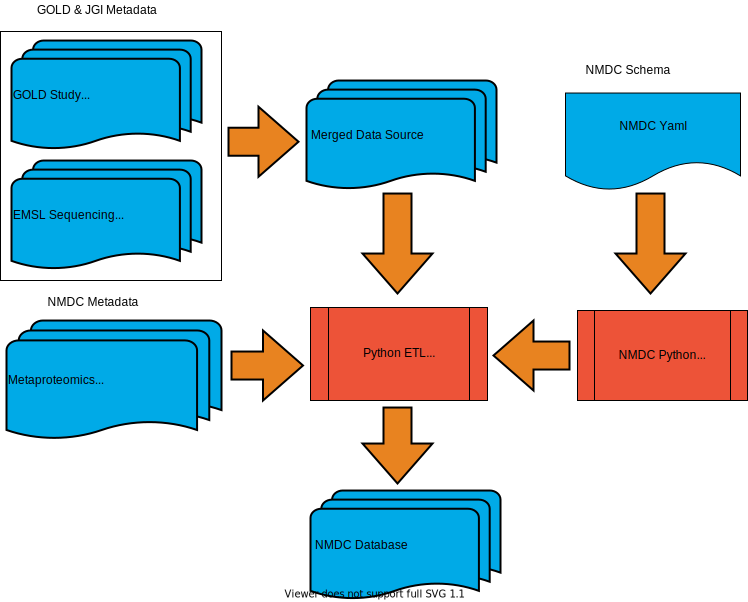

# Metadata translation
The metadata translation process brings together metadata from a number of data sources:
- [GOLD](https://gold.jgi.doe.gov/) 
- [JGI](https://jgi.doe.gov/) 
- [EMSL](https://www.pnnl.gov/environmental-molecular-sciences-laboratory)
- NMDC metagenome and metaprotemoic metadata 

Details about these metadata sources are descibed in the [data directory](src/data).  

This metadata is translated into JSON conformant with the [NMDC schema](https://github.com/microbiomedata/nmdc-metadata/tree/master/schema). The process is illustrated in the figure below.

- Metadata from [GOLD](https://gold.jgi.doe.gov/), [JGI](https://jgi.doe.gov/), and [EMSL](https://www.pnnl.gov/environmental-molecular-sciences-laboratory) is collected and merged into a single data source([nmdc_merged_data.tsv.zip](src/data/nmdc_merged_data.tsv.zip)) to facilate access.  
- The [NMDC schema](../schema/nmdc_schema_uml.png) is defined in using [yaml](../schema/nmdc.yaml) and transformed into a [python libary](../schema/nmdc.py) using the [biolink modeling language](https://github.com/biolink/biolinkml).
- NMDC metagenome and metaproteomic metadata is collected and input into the [python ETL pipeline](src/bin/execute_etl_pipeline.py) along with the [GOLD](https://gold.jgi.doe.gov/), [JGI](https://jgi.doe.gov/), and [EMSL](https://www.pnnl.gov/environmental-molecular-sciences-laboratory) metadata.
- [Python ETL pipeline](src/bin/execute_etl_pipeline.py) uses the [NMDC python libary](../schema/nmdc.py) to build the final [NMDC JSON database](src/data/nmdc_database.json.zip).  

 
